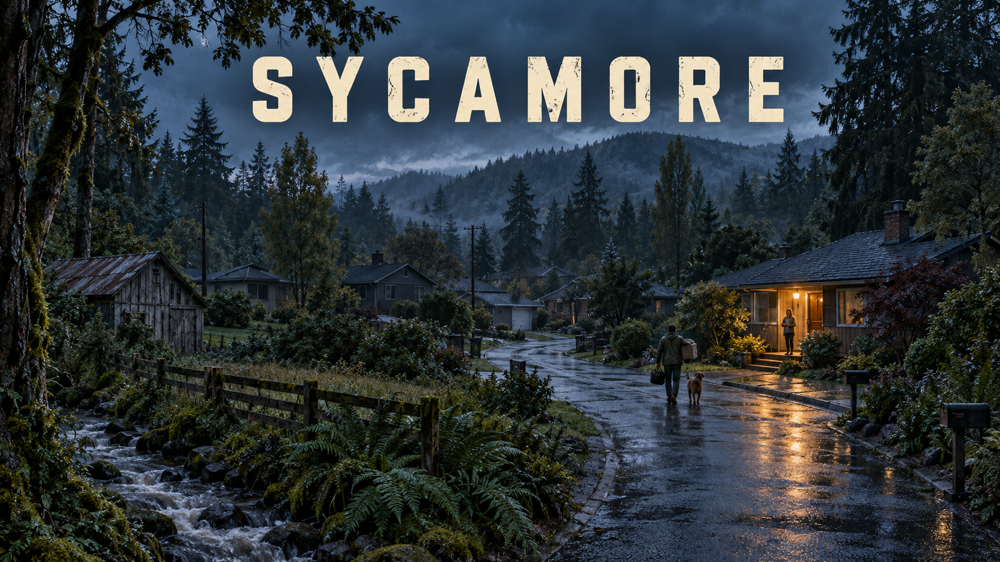

# Sycamore

A neighborhood survival concept by **King Made**.

**In development — no playable build is available yet.**

Protect your family, trade supplies, and build trust with neighbors as everyday services begin to fail. Set among the wooded streets and creek surroundings of Issaquah, Sycamore explores how ordinary households respond when cooperation becomes essential.

## Concept

- Explore a neighborhood through a planned angled 3D perspective.
- Carry useful supplies, repair household essentials, and prepare for the next night.
- Build relationships through trades, shared resources, and promises kept.

These are design intentions, not a feature list for a released build. Households, residents, pets, stories, and the cover's composite setting are fictional.

[View Sycamore in the King Made portfolio](https://kingmade.co/games/#sycamore)

This public project page shares the concept and selected artwork. It does not contain a playable game or the private geographic research data.
